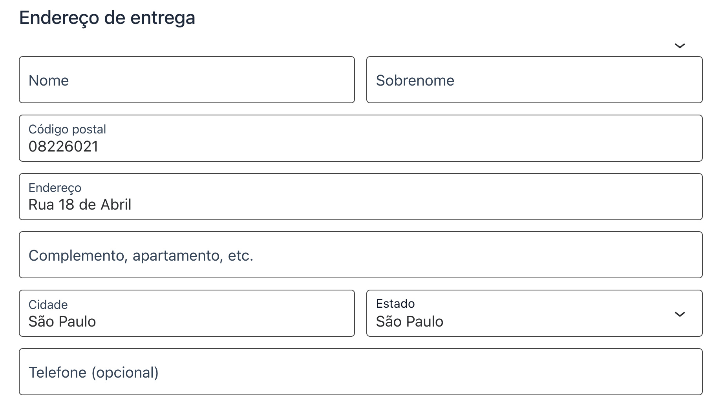
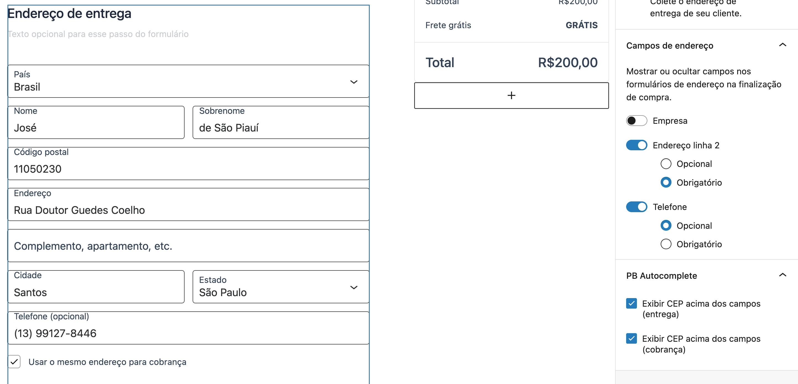

# PB Autocomplete — CEP para WooCommerce

Autocompleta endereço a partir do CEP no **Checkout em Blocos** do WooCommerce. Funciona apenas com **[PagBank Connect](https://wordpress.org/plugins/pagbank-connect/)** ativo e com **ao menos um método de pagamento** PagBank disponível no checkout.

> Para o diretório do WordPress.org, o arquivo em inglês é o [`readme.txt`](readme.txt). Este documento (`readme.md`) é destinado ao GitHub e à comunidade em português.

---

## Descrição

O **PB Autocomplete** preenche automaticamente os campos de endereço (rua, bairro, cidade, estado) no **Checkout em Blocos** quando o cliente informa o CEP. Utiliza as APIs públicas [OpenCEP](https://opencep.com/) (prioritária) e [ViaCEP](https://viacep.com.br/) (alternativa).

### Recursos

- Autocomplete de endereço por CEP no Checkout em Blocos (nativo do WooCommerce)
- Integração OpenCEP + ViaCEP (redundância)
- Opção para exibir o campo CEP como primeiro na seção de **cobrança** ou **entrega** (no editor de blocos, ao editar a página de checkout)
- Dependência explícita: WooCommerce e PagBank Connect instalados e ativos

### Requisitos

- [WooCommerce](https://wordpress.org/plugins/woocommerce/) instalado e ativo
- [PagBank Connect](https://wordpress.org/plugins/pagbank-connect/) instalado e ativo, com **pelo menos um** método de pagamento (PIX, cartão, boleto, etc.) **habilitado e disponível** no checkout
- Uso do **Checkout em Blocos** (não se aplica ao checkout legado / shortcode)

---

## Instalação

1. Certifique-se de que **WooCommerce** e **PagBank Connect** estão instalados e ativos.
2. Instale e ative o plugin **PB Autocomplete**  
   *(Plugins → Adicionar novo → procurar “PB Autocomplete” ou fazer upload do ZIP)*.
3. Se compilar a partir do código-fonte, na pasta do plugin execute:

```bash
npm install
npm run build
```

---

## Configuração

1. O autocomplete funciona no Checkout em Blocos quando o cliente digita um **CEP válido (8 dígitos)**. Os campos são preenchidos após consulta ao **OpenCEP** (ou **ViaCEP**, se necessário).
2. Para mostrar o **CEP primeiro** (acima do endereço): edite a **página de checkout** no editor de blocos, selecione o bloco **Endereço de entrega** ou **Endereço de cobrança**, abra no painel lateral a seção **PB Autocomplete**, marque as opções desejadas e clique em **Salvar** no topo da página.

---

## Perguntas frequentes

### O plugin funciona no checkout legado (clássico)?

**Não.** Foi desenvolvido apenas para o **Checkout em Blocos**. No checkout legado os campos não são preenchidos por este plugin.

### Por que o autocomplete não aparece no meu checkout?

Confira:

1. PagBank Connect ativo e com **pelo menos um** método de pagamento habilitado no WooCommerce;
2. Loja usando **Checkout em Blocos** (página de checkout em blocos);
3. CEP com **8 dígitos** e válido em OpenCEP ou ViaCEP.

### De onde vêm os dados de endereço?

Da API pública [OpenCEP](https://opencep.com/). Se estiver indisponível, usa [ViaCEP](https://viacep.com.br/).

### Posso usar sem o PagBank Connect?

**Não.** O plugin se integra ao ecossistema PagBank; sem PagBank Connect ativo e com método disponível, **o script de autocomplete não é carregado** no checkout.

### Como colocar o CEP como primeiro campo?

Edite a página de checkout no editor de blocos, selecione o bloco de endereço (entrega ou cobrança), abra **PB Autocomplete** no painel lateral, marque as opções e **Salve** a página.

---

## Capturas de tela

Imagens na pasta [`assets/`](assets/) (GitHub mostra Markdown com caminhos relativos ao repositório).

### Checkout com autocomplete



*Checkout em Blocos com campo CEP e autocomplete de endereço.*

### Editor de blocos — opções PB Autocomplete



*Painel **PB Autocomplete** no editor de blocos ao editar o bloco de endereço do checkout.*

---

## Changelog

### 1.0.3

- Versão atual do plugin (consulte o histórico no repositório para detalhes).

---

## Licença e metadados

| | |
|---|---|
| **Licença** | GPLv3 — [texto da licença](https://www.gnu.org/licenses/gpl-3.0.html) |
| **PHP** | 7.4+ |
| **WordPress** | 5.2+ (testado até 6.9 no `readme.txt`) |
| **Plugins obrigatórios** | `woocommerce`, `pagbank-connect` |

**Contribuidores:** martins56  
**Apoiar:** [GitHub Sponsors](https://github.com/sponsors/r-martins)
